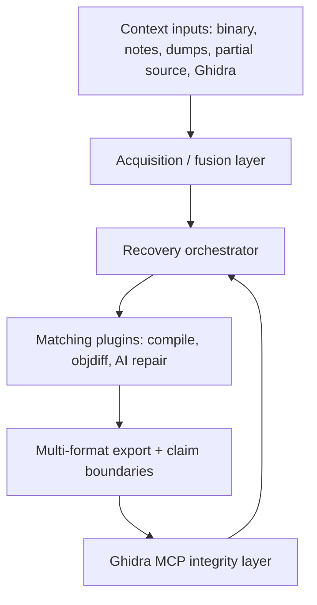

# feat: Unified AgentDecompile source-parity recovery

## Overview

Fold ReconstructKit (local Mizuchi hybrid) recovery capabilities into AgentDecompile as the single product: easy context acquisition, working PE/ELF/Mach-O recovery lanes, autonomous matching loops, anonymized schemas (no mizuchi/reconkit product branding), and proof-gated multi-format export. Target proof ladder honesty first; whole-binary 90% semantic parity remains aspirational.

## Problem Frame

Users need one tool that (1) accepts a binary plus optional context, (2) updates Ghidra/recovery state intelligently, and (3) emits clean, lintable, rebuildable source with claim boundaries—not parallel half-working stacks named differently.

## Goals

- Single product repo: AgentDecompile
- Context integration via CLI + MCP (partial source, notes, Ghidra dumps, project files)
- Documented recovery features work on `swkotor.exe`-class PEs and have ELF/Mach-O inventory paths
- Autonomous self-correcting recovery loop with objdiff (or stronger) acceptance
- Complete anonymization: no user-facing or schema `mizuchi` / dual `reconkit` brand; packages under `agentdecompile_*`
- Preserve AGPL attribution / MIT donor notices where required

## Non-Goals

- Claiming ≥90% semantic one-shot recovery of swkotor in this plan’s delivery window
- Replacing Ghidra with a from-scratch decompiler
- Requiring Node/React Atlas UI for core recovery (optional later)
- Any work in clifwrap

## Technical Approach

### Base and donor

| Role | Path / remote |
|------|----------------|
| Product base | this repo (`bolabaden/agentdecompile`), sync to latest `master` |
| Feature donor | `/home/brunner56/Workspaces/Mizuchi` (`reconkit_re`, acquisition, vacuum, PE lanes) |
| Reference only | `macabeus/mizuchi` TS (plugin lifecycle ideas already partly ported) |

### Architecture (post-merge)

### Naming freeze

- Product: `AgentDecompile`
- Packages: `agentdecompile_cli`, `agentdecompile_recovery` (absorb `reconkit_re` / retire `recovery_runtime` dual)
- Config: `agentdecompile.yaml`
- Schemas/prefixes: `agentdecompile.*` or neutral `recovery.*` — never `mizuchi.*` / `reconkit.*` in shipped artifacts
- MCP ids: `agentdecompile://…` / tool names without foreign brand

### Phases

#### Phase 0 — Workspace hygiene
- Branch from updated upstream `master` (leave unrelated WIP branches alone)
- Diff donor vs `src/agentdecompile_recovery/`
- Anonymization ripgrep gate checklist committed as a script or CI check

#### Phase 1 — Acquisition merge
- Port `acquire`, fingerprint registry, context-pack, ghidra-context, acquisition MCP tools
- CLI flags: `--context`, `--notes`, `--ghidra-export`, directory ingest
- Natural inputs: ingest manifest / unstructured notes with typed fact extraction where possible

#### Phase 2 — Recovery parity
- Diff-merge donor Python recovery ahead of in-repo recovery (windows/PE, source-parity one-shot, vacuum)
- Single orchestrator entry: `agentdecompile-reconstruct` / `agentdecompile-recover`
- Fix known blockers (analysis gate #48 class issues, reloc wrapper paths, synthesis accept path)

#### Phase 3 — Autonomy loop
- Vacuum/scorer/queue with compile+objdiff feedback
- Agent-native tools for repair cycles; terminate with match or typed failure
- Budget/cost controls so “autonomous” is not unbounded API spend

#### Phase 4 — Multi-format export
- Export views: asm slices, C/C++ candidates, advisory higher-level sketches, hex/authority packages, Ghidra-backed serialization
- Every artifact carries `claimBoundary` / `authorityClass`
- Lint pass (clang-format/ruff/gofmt as applicable) on accepted source only

#### Phase 5 — Proof ladder and swkotor critical path *(shipped 2026-07-17)*
- **Plan:** `docs/plans/2026-07-17-feat-phase5-proof-ladder.md` (completed)
- **Delivered:** `proof-ladder.json` rungs (1%→5%→20%), `critical-path.json` PE checkpoints, symbolized ELF `slice-verify/` receipts (#124–#127)

### Anonymization checklist (executable)

- [x] No `mizuchi` / `Mizuchi` in code, configs, MCP ids, cache paths, branch templates (except LICENSE/NOTICE attribution)
- [x] No shipped `reconkit` product branding once folded (internal git history OK)
- [x] Schema identifiers regenerated to `agentdecompile` / `recovery` namespaces
- [x] Toolchain paths configurable (no hardcoded `MizuchiSource` trees)
- [x] CI grep gate fails on banned tokens outside `NOTICE` / `third_party` (`scripts/check-anonymization.sh` in `test-unit.yml`)

#### Phase 6 — Context → Ghidra propose/apply *(shipped 2026-07-17)*
- **Plan:** `docs/plans/2026-07-17-feat-phase6-context-ghidra-propose.md` (completed)
- **Delivered:** `acquisition/propose-labels.json` from placed seeds; status `proposeLabels`; critical-path `apply-propose-labels` nextAction (apply remains opt-in via conflict protocol)

### UX contract (frozen before Phase 1)

Design-lens review ([design lens](f5d30922-f236-48b6-bd31-ed64920d8d15)) required these decisions before merge work. Do not invent competing surfaces during port.

#### Mental model

- **Primary:** `agentdecompile reconstruct <target> [context…]` — acquire + recover + report in one shot.
- **Advanced:** same command with `--stop-after` / `--resume` for stage checkpoints; `--autonomous` for vacuum/repair (not a peer product verb).
- **`recover`:** alias only in v1 docs/CLI; primary docs teach `reconstruct`.
- Stages are resume checkpoints, not a menu of peer CLIs (`acquire` / `vacuum` / `one-shot-…` as user-facing peers are banned).

#### Context IA

- Mix paths on the CLI; auto-sniff type (notes, dumps, partial source, Ghidra export); register by **target fingerprint**.
- Conventional bundle dir under AgentDecompile naming (e.g. `.agentdecompile/` or project `target/<id>/`) — never `.reconkit/` / `.mizuchi/`.
- First run may pass context paths; later `reconstruct <same-target>` resolves the registered bundle without re-passing paths.

#### Claim taxonomy (enum + placement)

| Class | Meaning |
|-------|---------|
| `objdiff-verified-semantic` | Accepted at objdiff 0 (or stronger object gate) |
| `byte-authoritative` | Replay/authority package; **not** semantic source |
| `advisory-decompiler` | Ghidra/m2c/LLM candidate; not proof |
| `context-hint` | Notes/labels from user context; advisory until verified |

Shown on: CLI summary line, machine `report.json`, every export header or sidecar, MCP tool result top-level. Every success report includes explicit non-claims (byte-authority ≠ semantic parity).

#### Interaction states

- **Terminal:** `matched` | `partial` | `failed:<class>` | `cancelled` | `blocked:toolchain`
- **In-run:** stage name, % inventoried, functions verified, budget remaining
- **Partial:** non-zero verified count; on disk segregate `verified/` vs `advisory/`
- Lint only runs on **accepted** (`objdiff-verified-semantic`) source

#### Three critical flows

1. **First-run packed PE:** unpack (Steamless missing → `blocked:toolchain`) → inventory → bounded recover → report with claim summary.
2. **Mid-run context:** add notes/dumps → re-acquire into same fingerprint → resume without wiping verified matches; conflicts recorded, not silently overwritten.
3. **MCP loop:** curated default tools only (reconstruct / status / claim-report + existing Ghidra integrity); loop ends in match or typed failure — no silent mush.

#### MCP advertisement policy

- **Default:** reconstruct, status, claim-report (+ Ghidra integrity tools already shipped).
- **Advanced/hidden until green:** vacuum internals, full receipt zoo, ELF/Mach-O inventory extras.
- Do not port donor’s full CLI surface as peer MCP tools.

#### v1 deliverable shape

- **Humans:** one markdown report + `verified/` source + coverage receipt.
- **Agents:** one JSON report with claim summary + terminal state.
- Full donor receipt tree only behind `--advanced-package` (deferred default).

#### Public copy freeze (swkotor)

Allowed: “verified N functions / X% of inventoried `.text` at objdiff 0.”
Banned in CLI/MCP/sample docs: “90% recovered”, “recovered swkotor”, “byte-accurate C” without a claim class.

#### Atlas UI

Deferred non-goal for core recovery; Python CLI + MCP only for this merge.

### Success criteria (near-term)

- `agentdecompile reconstruct <pe> --context <dir>` runs end-to-end and writes a report with honest claim boundaries
- Context artifacts update function/data labels in the active target without manual scripting
- ≥1 PE trivial/idiom lane and inventory for ELF/Mach-O green in CI or documented smoke
- Vacuum can accept a function at objdiff 0 and reject a near-miss
- Banned-name grep gate green
- Default MCP recovery surface stays curated (not a second 40-tool dashboard)
- On-disk `verified/` vs `advisory/` segregation present for partial runs

### Risks

| Risk | Mitigation |
|------|------------|
| Overclaim 90% | STRATEGY + claim taxonomy; KPI ladder; copy freeze |
| Dual package / dual-verb drift | Delete donor brands; `recover` alias only; one primary command |
| License erasure | Keep NOTICE; anonymize identifiers only |
| Wrong repo | Agent rooted at agentdecompile only |
| Host toolchain deps | Document Wine/MSVC/objdiff/Steamless; soft-fail with typed errors |
| Receipt / tool dashboard sprawl | UX contract + MCP advertisement policy |

## Open Questions

1. Fork/publish under which GitHub org once donor lands (upstream bolabaden vs personal fork)?
2. First public swkotor KPI phrase: freeze at 1% vs 5% verified `.text` for the first release note?

## References

- `STRATEGY.md` (this repo, 2026-07-13)
- Donor: `/home/brunner56/Workspaces/Mizuchi` STRATEGY + `src/reconkit_re/`
- Research brief: parent conversation (ce-repo-research-analyst)
