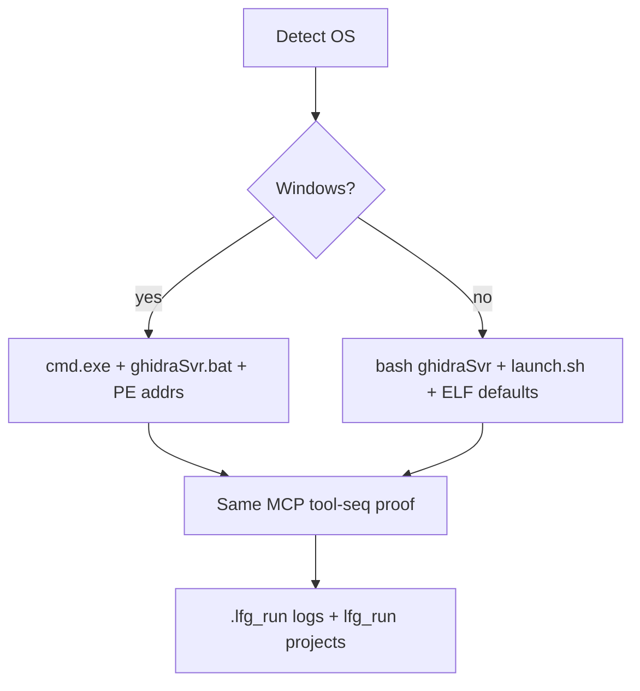

# feat: Linux-capable /lfg proof harness

## Summary

Make `scripts/lfg_cmd_sequence.ps1` (and `.cursor/commands/lfg.md`) runnable on Linux with PowerShell Core: unix `ghidraSvr` / `svrAdmin` / `launch.sh`, `.venv/bin/python`, and non-Windows import + label-address defaults—without breaking the existing Windows PE proof path.

Also fix a cross-platform MCP outage: WebUI sidecar import of renamed `build_tool_reference_payload` crashed the server immediately after ready (daemon uvicorn died with main).

## Objective (this LFG cycle)

- Unblock live shared-server + MCP `/lfg` on this Linux host (pwsh present; `cmd.exe` absent).
- Preserve Windows behavior when `.bat` / `cmd.exe` / PE `sort.exe` are available.
- Keep harness proof-honest: same checkout/label/checkin/restart sequence; only host glue changes.
- Document Linux prerequisites and defaults in `.cursor/commands/lfg.md`.
- Keep MCP server alive after ready (WebUI sidecar must not take down the process).

## Problem Frame

Phase 6 deferred the Linux `/lfg` port. On Fedora, the driver fails before MCP: it patches/launches `ghidraSvr.bat` via `cmd.exe`, hardcodes `.venv/Scripts/python.exe`, and defaults import to `C:/Windows/System32/sort.exe` with PE64 label VAs (`0x140002000+`). The unix install already has `server/ghidraSvr`, `server/svrAdmin`, and `support/launch.sh`. Agents cannot run the canonical live harness here without a host port.

## Requirements

- R1. On non-Windows, resolve Python as `.venv/bin/python` (then `uv run` / `python3` fallback) before `.venv/Scripts/python.exe`.
- R2. On non-Windows with `AutoStartGhidraServer`, start Ghidra Server via unix `ghidraSvr` (headless/background, logs under evidence)—**no** `cmd.exe` requirement.
- R3. On non-Windows, `svrAdmin` / user probes use unix `svrAdmin` or `support/launch.sh` equivalents—not `launch.bat` + `cmd.exe`.
- R4. Default `ImportSource` on non-Windows is a present local binary (prefer `/usr/bin/sort`); keep Windows default unchanged.
- R5. Label / inspect addresses are parameterized: Windows keeps PE64 `sort.exe` base; Linux uses an ELF-safe default base (or `-AddressBase`) so `create-label` hits mapped memory for the default import.
- R6. Windows path remains the regression baseline when `cmd.exe` + `ghidraSvr.bat` exist.
- R7. Docs in `.cursor/commands/lfg.md` state Linux prerequisites (`pwsh`, `GHIDRA_INSTALL_DIR`, unix server scripts).

## Scope Boundaries

### In scope

- Host detection helpers in `scripts/lfg_cmd_sequence.ps1`
- Unix start/stop/admin paths for Ghidra Server
- Python + ImportSource + address-base defaults
- Doc updates to `.cursor/commands/lfg.md`

### Deferred

- Full green end-to-end Linux run as a CI job (local smoke only this cycle)
- Rewriting the driver in bash/Python
- Changing MCP product tools for Linux
- Wine-based PE fixture as the primary Linux path

### Outside product identity

- Claiming the recovery proof ladder is green because the harness starts
- Shipping dual donor brands

## Key Technical Decisions

- KTD1. **One script, branched glue** — Keep `lfg_cmd_sequence.ps1` as SoT; add OS branches rather than a second driver. Rationale: command doc and agent muscle memory stay one path.
- KTD2. **Unix `ghidraSvr console` backgrounded** — Redirect stdout/stderr to evidence logs; track PID for stop. Prefer native shell script over wine/`cmd.exe`. Rationale: matches existing “no extra window / no TTY attach” hygiene.
- KTD3. **Address base param** — Introduce `$AddressBase` (default PE on Windows, ELF-friendly default on Unix). Slide math stays the same. Rationale: create-label must land in defined memory without analysis.
- KTD4. **Default import `/usr/bin/sort`** — Same program name theme as Windows `sort.exe`; shared path may keep `.exe` suffix for fixture stability or switch to a linux-named path via param. Rationale: minimal assert churn; callers can override.

## Implementation Units

### U1. Resolve host Python + import defaults

**Files:** `scripts/lfg_cmd_sequence.ps1`; docs: `.cursor/commands/lfg.md`

**Approach:** Detect non-Windows (`$IsLinux` / `$IsMacOS` / `[System.Runtime.InteropServices.RuntimeInformation]::IsOSPlatform`). Prefer `.venv/bin/python` then existing Windows path. If default Windows `ImportSource` is missing on Unix, set `/usr/bin/sort` (throw if absent and caller did not override).

**Test scenarios:**
- On Linux with `.venv/bin/python`, driver selects that path (manual/scripted assert or dry log line).
- On Windows, `.venv/Scripts/python.exe` still preferred when present.
- Missing default import on Unix without override → clear error naming expected path.

### U2. Unix Ghidra Server start / stop / svrAdmin

**Files:** `scripts/lfg_cmd_sequence.ps1`

**Approach:** Branch `Invoke-LfgGhidraServerHeadless`, `Invoke-LfgGhidraSvrAdmin`, `Test-LfgGhidraSvrAdminUserKnown` (and stop helpers as needed) to use `$GhidraRoot/server/ghidraSvr` + `$GhidraRoot/server/svrAdmin` or `support/launch.sh` when bat/cmd path unavailable. Preserve patched-bat Windows path.

**Test scenarios:**
- Linux auto-start reaches users file / TCP without invoking `cmd.exe`.
- `svrAdmin -add` / `-users` succeed against isolated conf.
- Stop cleans the unix server process started by the driver.
- Windows bat path unchanged when `cmd.exe` exists.

### U3. Parameterize label address base for ELF default import

**Files:** `scripts/lfg_cmd_sequence.ps1`; `.cursor/commands/lfg.md`

**Approach:** Replace hard-coded `0x140002000` with `$AddressBase` defaulting to PE base on Windows and an ELF-safe base for `/usr/bin/sort` (document chosen base; allow override). Keep slide offsets.

**Test scenarios:**
- Linux default bases produce addresses that `create-label` accepts after import (local smoke).
- Explicit `-AddressBase` overrides default on both OSes.
- Windows default remains `0x140002000` unless overridden.

## Phased Delivery

| Phase | Units | Outcome |
|-------|-------|---------|
| 7a | U1, U2 | Driver can start Ghidra Server + MCP on Linux |
| 7b | U3 | Label/checkin cycles work with default Linux import |

Recommended first `/ce-work` slice: **7a (U1+U2)**; land U3 in the same PR if smoke reaches create-label.

## Success Metrics

- On Linux: driver progresses past Ghidra bootstrap without `cmd.exe`
- Windows PE `/lfg` path not regressed (code review + path guards)
- Docs mention Linux `pwsh` + unix server scripts

## Risks

| Risk | Mitigation |
|------|------------|
| ELF image base wrong → create-label fails | U3 + override param; smoke before claim |
| unix `ghidraSvr console` still TTY-blocking | Background + redirect; PID tracking |
| Wrapper/conf isolation differs on Linux | Reuse existing isolated conf generation; verify paths use `/` |
| Scope expands into full CI LFG | Explicitly deferred |

## Sources

- `.cursor/commands/lfg.md`
- `scripts/lfg_cmd_sequence.ps1`
- `docs/plans/2026-07-17-feat-phase6-context-ghidra-propose.md` (deferred Linux LFG)
- `AGENTS.md` — Cursor Cloud / Ghidra install notes
