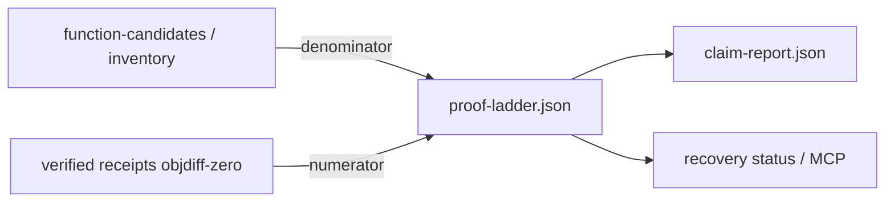
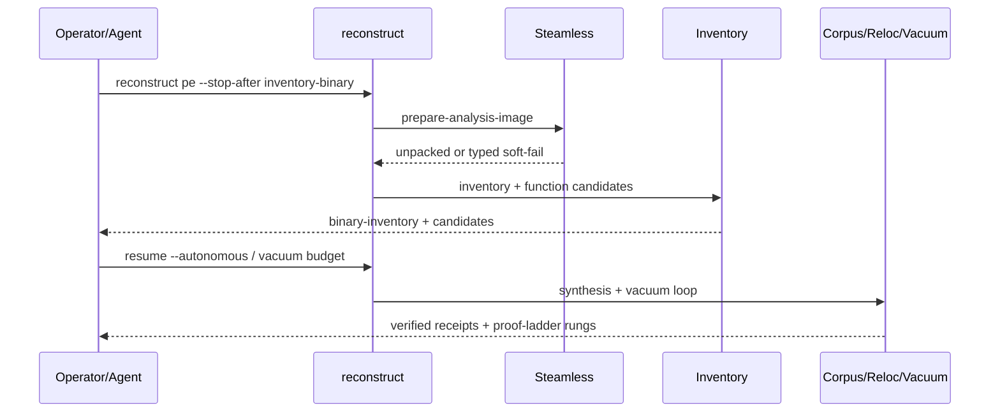

# feat: Phase 5 proof ladder and swkotor critical path

## Summary

Wire an honest **proof ladder** into reconstruct: compute coverage from inventoried functions vs receipt-backed `objdiff-verified-semantic` accepts, emit rung status (1% → 5% → 20%), and expose a PE critical-path orchestration that chains Steamless → inventory → corpus/reloc primitives → vacuum without claiming ≥90% parity. Add a bounded ELF/Mach-O symbolized slice-verify lane so non-PE formats stay first-class for inventory + slice proof—not PE feature parity marketing.

## Problem Frame

Phases 0–4 delivered acquisition fusion, PE recovery lanes, autonomy budgets/vacuum, and multi-format export with claim boundaries. What is still missing is a **machine-readable coverage ladder** and a **documented critical path** for hard PE targets (swkotor-class) that operators and agents can chase without overclaiming. Today `claim-report.json` counts `objdiffVerified` but does not compute percent-of-inventory rungs; swkotor helpers live as scripts/`target/` defaults rather than reconstruct stages; ELF/Mach-O inventory exists but slice verify for symbolized bins is not a first-class stop-after path (see origin Phase 5).

---

## Requirements

- R1. Every reconstruct/recover run that reaches `report` emits a proof-ladder receipt with inventoried denominator, objdiff-verified numerator, coverage percent, current rung, and explicit claim boundary forbidding ≥90% marketing.
- R2. Ladder rungs are fixed at **1% → 5% → 20%** of inventoried functions with receipt-backed objdiff-zero accepts (not bare `verified/` file counts, not `acceptedCandidates`).
- R3. Claim report and recovery status surface ladder fields without promoting advisory/byte-authority artifacts into semantic coverage.
- R4. PE critical path is operable via reconstruct `--stop-after` checkpoints (and/or a thin orchestrator helper) covering: Steamless unpack → binary/function inventory → compiler-profile corpus hooks → reloc target objects → vacuum seed/run, with typed soft-fail when Steamless/MSVC/objdiff are unavailable.
- R5. Public/CLI/MCP copy for swkotor-class targets stays within the origin freeze: allowed “verified N / X% of inventoried functions at objdiff 0”; banned “90% recovered” / “recovered swkotor” without claim class.
- R6. Symbolized ELF and Mach-O binaries support inventory + bounded slice verify that can produce (or honestly refuse) objdiff-class or documented weaker slice proof with claim boundaries—before any PE parity claims for those formats.
- R7. CI proves ladder math and claim honesty with fixtures; live `swkotor.exe` is optional local smoke, not a required CI binary.

---

## Scope Boundaries

### In scope

- Proof-ladder schema + computation + surfacing in claim/status/report
- Critical-path stage wiring / stop-after documentation for PE unpack→match loop
- Thin glue from existing Steamless, inventory, profile corpus, reloc-slice, and vacuum modules into that path
- ELF/Mach-O symbolized slice-verify vertical slice

### Deferred for later

- Actually reaching 5% or 20% on real swkotor.exe in-repo (KPI chase after ladder exists)
- Whole-binary rebuild / link of swkotor
- Atlas UI
- Donor brand remnants cleanup beyond existing anonymization gate

### Outside this product's identity

- Claiming ≥90% semantic one-shot recovery of large game EXEs
- Treating byte-authority / `.incbin` / advisory decompiler output as ladder numerator
- Dual mizuchi/reconkit product surfaces

### Deferred to Follow-Up Work

- Ghidra headless-driven live serialization at export time (offline packaging already shipped in Phase 4)
- Expanding vacuum plugin corpus quality for hard game idioms

---

## Assumptions

Headless planning from origin Phase 5 + STRATEGY; no fresh brainstorm. Inferred bets:

- A1. **Denominator = inventoried function candidates** from reconstruct (`function-candidates.json` / analysis enrichment), falling back to inventory summary counts when candidates are absent—not raw `.text` byte percent—unless a run explicitly opts into a documented byte-coverage metric later.
- A2. **First shippable rung is the ladder itself at 1% semantics**, not a guarantee that any particular binary hits 1% in CI.
- A3. **swkotor remains the reference PE**, but fixtures + optional local smoke satisfy R7; no binary checked into git.

---

## Key Technical Decisions

- KTD1. **Ladder numerator is receipt-backed objdiff only** — Reuse `claim_report._count_objdiff_verified` / equivalent; never count bare `verified/*.c`. Rationale: origin + STRATEGY forbid false-claim inflation.
- KTD2. **Coverage = numerator / max(denominator, 1)** with rung = highest threshold ≤ coverage among `{0.01, 0.05, 0.20}`; below 1% rung is `below-1` (not a failure of the run). Rationale: honest progress without flunking partial reconstructs.
- KTD3. **New schema `agentdecompile.proof-ladder.v1`** written to `proof-ladder.json` and embedded under claim-report / report / recovery-status. Rationale: agents need a stable machine contract; humans get the same numbers in the markdown report later.
- KTD4. **Critical path reuses existing stages first** — Prefer `prepare-analysis-image` (Steamless), `inventory-binary`, `discover-functions`, synthesis/vacuum hooks over new peer CLIs. Rationale: UX contract bans acquire/vacuum as peer product verbs; reconstruct remains primary.
- KTD5. **ELF/Mach-O slice verify starts symbolized-only** — Require symbol table function symbols; unsigned stripped bins stay inventory-only with typed `unsupported-slice-verify`. Rationale: Phase 5 text explicitly prioritizes symbolized bins before PE parity claims.
- KTD6. **No live Ghidra required for ladder math** — Ladder is work-dir receipt arithmetic. Rationale: CI and headless hosts without Ghidra must still report honesty.

---

## High-Level Technical Design

Directional guidance only — not implementation specification.

### Ladder data flow



### PE critical path (stop-after checkpoints)



### Output structure (work dir additions)

```text
<workDir>/
  proof-ladder.json          # agentdecompile.proof-ladder.v1
  claim-report.json          # gains proofLadder field
  report.json                # gains proofLadder summary
  ... existing stages ...
```

---

## Implementation Units

### U1. Proof-ladder computation and schema

**Goal:** Pure function + writer that turns work-dir inventory/receipts into `proof-ladder.json`.

**Files:**
- Create: `src/agentdecompile_recovery/proof_ladder.py`
- Modify: `src/agentdecompile_recovery/claim_report.py`
- Test: `tests/test_proof_ladder.py`

**Approach:** Compute denominator from function-candidate rows (prefer analyzed/code-bearing), numerator via existing objdiff receipt rules, emit rungs + `nextRung` + `claimBoundary`. Soft-empty work dirs yield `status: empty` with 0/0 guarded percent.

**Execution note:** test-first for rung thresholds and false-claim rejection.

**Test scenarios:**
- Happy path: 100 candidates, 1 objdiff receipt → coverage 0.01, rung `1%`
- Happy path: 100 candidates, 5 receipts → rung `5%`; 20 → `20%`
- Edge: 0 candidates → denominator 0, status `empty` or `no-inventory`, coverage null/0 with boundary text
- Edge: bare `verified/foo.c` without receipt → numerator 0
- Error: corrupt candidate JSON → skip bad rows, do not crash run
- Integration: `build_claim_report` includes `proofLadder` mirroring file

**Verification:** Unit tests green; schema string stable; claim boundary mentions objdiff-only numerator.

---

### U2. Surface ladder in pipeline report and recovery status

**Goal:** Operators/agents see ladder without reading a new CLI verb.

**Files:**
- Modify: `src/agentdecompile_recovery/pipeline.py` (`stage_report`)
- Modify: `src/agentdecompile_recovery/recovery_status.py`
- Modify: `tests/test_recovery_mcp.py` (or dedicated status test)
- Test: `tests/test_proof_ladder.py` (status embedding cases)

**Approach:** After claim report write, ensure `proof-ladder.json` exists; add compact summary to `report.json` and `exportPackage`-style status field `proofLadder`.

**Test scenarios:**
- Happy path: status dict includes rung + coverage + claimBoundary
- Edge: missing ladder file → status `proofLadder: null` without KeyError
- Integration: reconstruct fixture run reaching report writes both claim + ladder

**Verification:** Status schema remains v1-compatible (additive fields only).

---

### U3. PE critical-path stop-after documentation and soft-fail receipts

**Goal:** Make Steamless→inventory→match loop operable and discoverable without new peer product CLIs.

**Files:**
- Modify: `src/agentdecompile_recovery/pipeline.py` and/or `frontdoor.py` only if checkpoint naming/docs need alignment
- Modify: `docs/` recovery/reconstruct docs (shortest existing operator doc) OR CLI `--help` epilog for stop-after critical path
- Optionally create: `src/agentdecompile_recovery/critical_path.py` thin helper that validates expected receipts exist after each checkpoint
- Test: `tests/test_critical_path_receipts.py`

**Approach:** Document ordered `--stop-after` values for the critical path; add a receipt checker that returns typed missing-stage errors. Reuse `prepare-analysis-image` Steamless behavior already in pipeline; do not reimplement unpack.

**Test scenarios:**
- Happy path: mock work dir with analysis-target + inventory + candidates → checker `ready-for-vacuum`
- Edge: packed PE without Steamless → checker reports soft-fail class already present on analysis-target
- Error: unknown checkpoint name → clear error listing allowed stages

**Verification:** No new top-level verb; reconstruct remains primary (origin UX contract).

---

### U4. Wire corpus / reloc / vacuum into critical-path readiness (glue only)

**Goal:** After inventory, expose “next actions” for profile corpus, reloc target objects, and vacuum seeding using existing modules.

**Files:**
- Modify: `src/agentdecompile_recovery/vacuum_queue.py` / pipeline autonomous hooks as needed
- Modify: `src/agentdecompile_recovery/source_parity_profile_corpus.py` (call surface only if needed)
- Reference: `src/agentdecompile_recovery/swkotor_inventory_slice.py`, `scripts/swkotor-match-reloc-wrappers.py` (patterns; prefer library APIs over script subprocess)
- Test: `tests/test_critical_path_next_actions.py`

**Approach:** Emit `critical-path.json` (or ladder sibling) listing available next tools/stages with paths to inventory/tasks—not automatic full swkotor grind. Vacuum seed remains budget-gated.

**Test scenarios:**
- Happy path: work dir with function candidates → nextActions includes vacuum-seed + reloc-slice when tools present
- Edge: capabilities missing MSVC/objdiff → nextActions mark those steps `blocked` with reason
- Integration: autonomous policy still respects budget when vacuum listed

**Verification:** Does not claim semantic coverage from listing next actions.

---

### U5. ELF/Mach-O symbolized slice verify

**Goal:** Symbolized non-PE bins get inventory + one bounded slice verify path with honest claims.

**Files:**
- Modify: `src/agentdecompile_recovery/inventory.py` (only if symbol export gaps block slice selection)
- Create or modify: slice-verify helper under `src/agentdecompile_recovery/` (prefer extending existing package_verify / sourcegen boundaries over new mega-module)
- Test: `tests/test_elf_macho_slice_verify.py`
- Fixtures: tiny symbolized ELF/Mach-O under `tests/fixtures/` (or generate in-test)

**Approach:** Select a function symbol from inventory; extract bytes; compile/objdiff or documented relocation-masked compare with claimBoundary weaker than full PE objdiff when toolchains differ. Stripped bins → typed skip.

**Execution note:** characterization-first if touching fragile package_verify paths.

**Test scenarios:**
- Happy path: tiny symbolized ELF → inventory lists symbol → slice verify produces receipt with claim class
- Happy path: tiny symbolized Mach-O (or skip with explicit platform reason in CI matrix notes)
- Edge: stripped ELF → `unsupported-slice-verify` / skip, inventory still succeeds
- Error: malformed binary → InventoryError typed, no crash of outer CLI
- Integration: proof ladder denominator can include ELF candidates when reconstruct run uses ELF target

**Verification:** No PE feature-parity claim language in ELF/Mach-O receipts.

---

### U6. Origin plan + STRATEGY KPI alignment (docs only)

**Goal:** Mark Phase 5 as the active track; freeze public KPI phrase at ladder rungs.

**Files:**
- Modify: `docs/plans/2026-07-13-feat-unified-source-parity-recovery.md` (Phase 5 pointer / status only)
- Modify: `STRATEGY.md` key metrics note for ladder rungs if needed (one short paragraph)

**Test expectation:** none -- documentation only

**Verification:** Origin open question #2 answered in this plan as: first public phrase uses measured X% with rung context, not a frozen marketing floor of 5%.

---

## Phased Delivery

| Phase | Units | Outcome |
|-------|-------|---------|
| 5a Ladder honesty | U1, U2, U6 | Every run reports honest coverage rungs |
| 5b PE critical path | U3, U4 | Operators can chase swkotor-class path without new verbs |
| 5c Cross-format | U5 | ELF/Mach-O symbolized slice proof exists |

Recommended first `/ce-work` slice: **5a (U1+U2)**.

---

## Alternative Approaches Considered

- **Byte-% of `.text` as primary KPI** — Rejected as default (kept optional later): easier to game with padding; STRATEGY emphasizes function parity.
- **New `agentdecompile proof-ladder` peer CLI** — Rejected: violates reconstruct-primary UX contract; status/claim embedding is enough.
- **Require live swkotor in CI** — Rejected: binary size/licensing/host deps; fixtures prove math; local smoke optional.

---

## Success Metrics

- Ladder receipt present on reconstruct report stage
- Fixture run demonstrates rung transitions 1/5/20 without false numerator
- Critical-path checker documents Steamless soft-fail
- At least one symbolized ELF slice-verify unit test green in CI

---

## Risks & Dependencies

| Risk | Mitigation |
|------|------------|
| Inflating numerator via verified/ trees | KTD1 + unit tests with bare sources |
| Steamless/mono unavailable on hosts | Typed soft-fail already in prepare-analysis-image; critical-path checker surfaces it |
| Mach-O CI hosts vary | Allow platform-skip with explicit reason; ELF primary in Linux CI |
| Operators still chase 90% | R5 + claimBoundary + STRATEGY not-working-on |

**Dependencies:** existing objdiff/MSVC/Wine tooling for real PE vacuum; Steamless under `target/steamless-release/extracted/` for packed PE smoke.

---

## System-Wide Impact

- Additive JSON fields on claim/status/report — MCP/CLI consumers should tolerate unknown fields
- No change to export authority classes required for 5a; ladder is proof meta, not an export view
- Autonomy budgets unchanged; ladder does not start unbounded vacuum

---

## Open Questions

None blocking. Origin org-hosting question remains outside this plan.

---

## Sources & Research

- Origin: `docs/plans/2026-07-13-feat-unified-source-parity-recovery.md` (Phase 5, public copy freeze, success criteria)
- Strategy: `STRATEGY.md` (verified function parity metric; not-working-on ≥90%)
- Existing code: `claim_report.py`, `pipeline.py` (Steamless prepare), `inventory.py` (PE/ELF/Mach-O), `source_parity_profile_corpus.py`, `vacuum_runner.py`, `swkotor_inventory_slice.py`, `package_verify.py`
)
