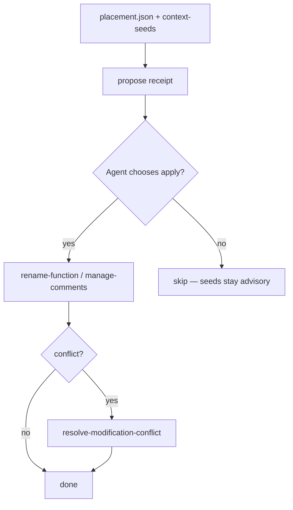

# feat: Phase 6 propose Ghidra labels from placed context seeds

## Summary

Close the context → Ghidra loop for **placed** puzzle pieces only: emit an explicit propose/apply path that renames (or comments) functions via existing MCP mutation tools and the modification-conflict protocol—never silent bulk apply, never inventing VAs for unplaced pieces.

## Objective (this LFG cycle)

- Wire placed acquisition facts / context-seed metadata into a **propose** receipt agents can act on.
- Apply only through existing `rename-function` / `manage-comments` (or equivalent) + conflict resolution—no new silent DB mutation path.
- Keep advisory seeds out of proof-ladder numerator.
- Document operator/agent flow in `docs/CONTEXT_FUSION.md`.

## Problem Frame

Phase 5 + context fusion shipped acquisition, placement, advisory seeds, proof ladder, and critical-path nextActions. Deferred work explicitly left **auto-apply into open Ghidra programs**. Operators still copy names by hand. STRATEGY metric **context merge yield** stays low until placed pieces can update Ghidra without silent overwrite.

## Requirements

- R1. Propose list is **address-keyed placed facts only** (from `acquisition/placement.json` and/or seed sidecars); unplaced pieces never appear as apply candidates.
- R2. Propose receipt is advisory (`authorityClass: context-hint`); applying does not count toward proof ladder.
- R3. Apply uses existing MCP mutating tools + conflict protocol; no silent overwrite of custom names.
- R4. CLI/MCP surface stays reconstruct-primary: either a reconstruct/status field or a thin `propose-context-labels` recovery helper—no peer `acquire` verb.
- R5. Conflicts at the same address (from placement) are listed, not auto-picked.
- R6. Unit tests cover empty placement, placed rename propose shape, and unplaced exclusion.

## Scope Boundaries

### In scope

- Propose receipt writer + status surfacing
- Thin apply helper or documented agent sequence using existing tools
- Docs update to CONTEXT_FUSION.md

### Deferred

- Embedding / fuzzy match for unplaced notes
- Bulk apply without per-conflict confirmation
- Live Ghidra headless serialization at export (Phase 4/5 deferred)
- Linux port of `lfg_cmd_sequence.ps1` (separate track)

### Outside product identity

- Treating applied labels as objdiff-verified-semantic proof

## Key Technical Decisions

- KTD1. **Propose ≠ apply** — Default is write `acquisition/propose-labels.json` (or under work dir) for agents; apply is opt-in.
- KTD2. **Reuse conflict protocol** — Do not invent a second overwrite path.
- KTD3. **MCP: extend status / reconstruct payload** — Prefer additive fields over a new curated tool unless agent-native audit requires a named tool.
- KTD4. **Linux `/lfg` proof harness** — Out of scope for this plan; tracked as follow-up if needed.

## Implementation Units

### U1. Propose receipt from placement + seeds

**Files:** Create or extend under `src/agentdecompile_recovery/` (e.g. `context_propose.py`); Test: `tests/test_context_propose.py`

**Approach:** Read placement + seed metadata; emit proposed renames `{address, currentHint, proposedName, sourceKind, claimBoundary}`.

**Test scenarios:** placed-only list; unplaced excluded; conflict rows marked `status: conflict` without pick.

### U2. Surface in recovery status / reconstruct claim path

**Files:** `recovery_status.py`, optionally `frontdoor.py` after acquire; tests in status suite.

### U3. Apply path documentation + optional thin wrapper

**Files:** `docs/CONTEXT_FUSION.md`; optional MCP/CLI glue that calls existing rename tools with conflict handling—characterization-first if touching providers.

**Verification:** No silent rename without conflict id when custom data exists.

## Phased Delivery

| Phase | Units | Outcome |
|-------|-------|---------|
| 6a | U1, U2 | Agents see propose list from placed pieces |
| 6b | U3 | Documented/optional apply via conflict protocol |

Recommended first `/ce-work` slice: **6a (U1+U2)**.

## Success Metrics

- Propose receipt present after reconstruct with context pieces
- Zero unplaced addresses in propose list
- Status exposes propose counts + claimBoundary

## Risks

| Risk | Mitigation |
|------|------------|
| Agents treat propose as verified | claimBoundary + authorityClass |
| Double-rename races | conflict protocol only |
| Scope creep into Linux LFG | Explicitly deferred |

## Sources

- `docs/brainstorms/2026-07-17-context-puzzle-piece-fusion-requirements.md` (Deferred: auto-apply)
- `docs/CONTEXT_FUSION.md`
- `STRATEGY.md` — context merge yield
- `docs/plans/2026-07-17-feat-phase5-proof-ladder.md` (completed)
