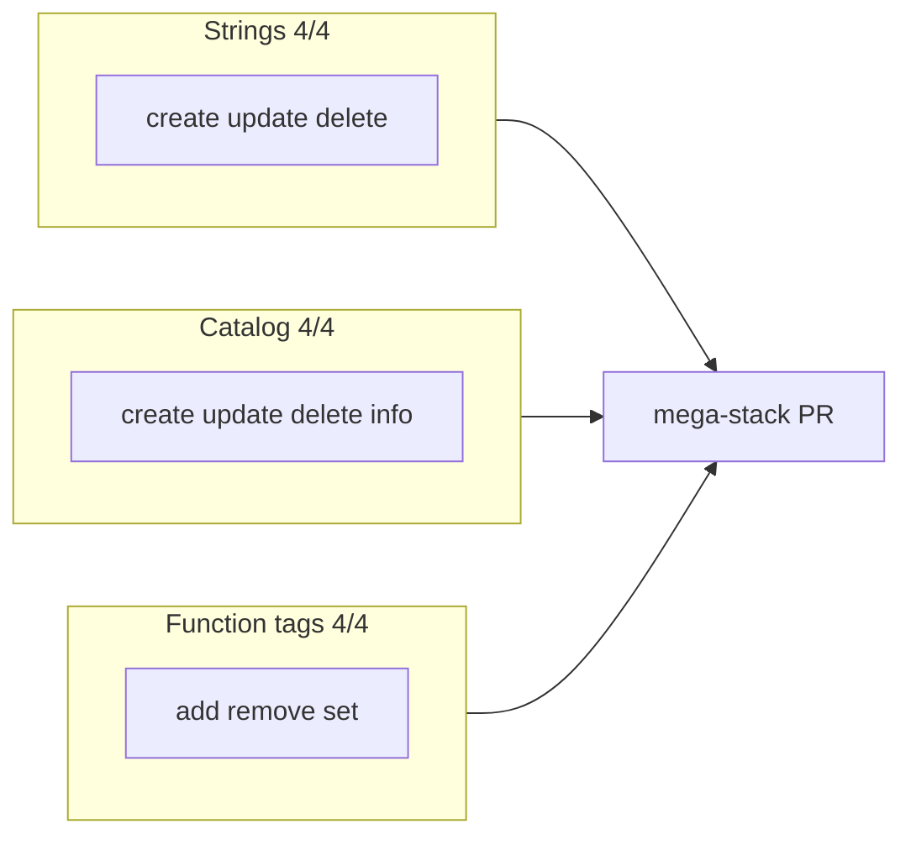

# Agent-native CRUD arc

## Problem

The 2026-05-24 audit listed **strings CRUD**, **data-type catalog create**, **catalog update**, and **function-tag set** as remaining gaps across `manage-strings`, `manage-data-types`, and `manage-function-tags`.

## Solution (mega-stack PR #111)

**Merged** squash `b72a932` (PR [#111](https://github.com/bolabaden/AgentDecompile/pull/111), 2026-05-29) on `master`. Supersedes #105–#110.



| Slice | Deliverable |
|-------|-------------|
| Strings | `manage-strings` create/update/delete |
| Catalog | `manage-data-types` create/update/delete/info |
| Tags | `manage-function-tags` set replaces all tags |
| **Merge** | One PR → **12/12 CRUD (100%)** |

## Audit impact

| Entity | Before | After |
|--------|--------|-------|
| Strings | 1/4 | **4/4** |
| Data types (catalog) | 2/4 | **4/4** |
| Function tags | 3/4 | **4/4** |
| CRUD completeness | 9/12 (75%) | **12/12 (100%)** |

## Patterns

- Mutating multi-mode tools: return `action` in JSON; gate UI hints via `_MUTATING_TOOL_ACTIONS` in `program_metadata.py`.
- Catalog CRUD: `TypedefDataType` + `dtm.addDataType()` / `dtm.remove()` with conflict flow on create/rename.
- Function-tags set: clear `func.getTags()` then `addTag` each name in one transaction.

## Verification

```bash
uv run pytest tests/test_manage_strings.py tests/test_manage_data_types.py tests/test_manage_function_tags.py -m unit -q --timeout=60
uv run pytest -m unit -q --timeout=120
```
