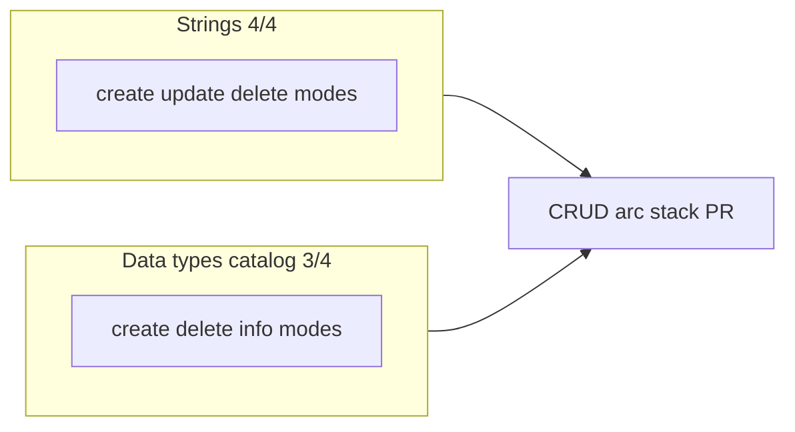

# Agent-native CRUD arc

## Problem

The 2026-05-24 audit listed **strings CRUD** and **data-type catalog create** as remaining gaps. `manage-strings` was read-only despite registry classifying it as state-writing; `manage-data-types` could list/parse/apply but not add or remove catalog typedefs.

## Solution (stack PR #107)

Combines [#105](https://github.com/bolabaden/AgentDecompile/pull/105) and [#106](https://github.com/bolabaden/AgentDecompile/pull/106) on branch `impl/crud-arc-stack-c2bc`. **Ship PR:** [#107](https://github.com/bolabaden/AgentDecompile/pull/107).



| PR | Deliverable | Key files |
|----|-------------|-----------|
| [#105](https://github.com/bolabaden/AgentDecompile/pull/105) | `manage-strings` create/update/delete | `providers/strings.py`, `test_manage_strings.py` |
| [#106](https://github.com/bolabaden/AgentDecompile/pull/106) | `manage-data-types` create/delete/info | `providers/datatypes.py`, `test_manage_data_types.py` |
| Stack | **Single merge** to `master` | [#107](https://github.com/bolabaden/AgentDecompile/pull/107) supersedes #105–#106 |

## Audit impact (when #107 merges)

| Entity | Before | After |
|--------|--------|-------|
| Strings | 1/4 | **4/4** |
| Data types (catalog) | 2/4 | **3/4** (update still partial) |
| CRUD completeness | 9/12 (75%) | **10/12 (83%)** |

## Patterns

- Mutating multi-mode tools: return `action` in JSON; gate UI hints via `_MUTATING_TOOL_ACTIONS` in `program_metadata.py`.
- Catalog create: parse C type string → `TypedefDataType` + `dtm.addDataType()` with conflict flow.
- String create: `memory.setBytes` + `listing.createData` with `string`/`unicode` types inside `_run_program_transaction`.

## Verification

```bash
uv run pytest tests/test_manage_strings.py tests/test_manage_data_types.py -m unit -q --timeout=60
uv run pytest -m unit -q --timeout=120
```
