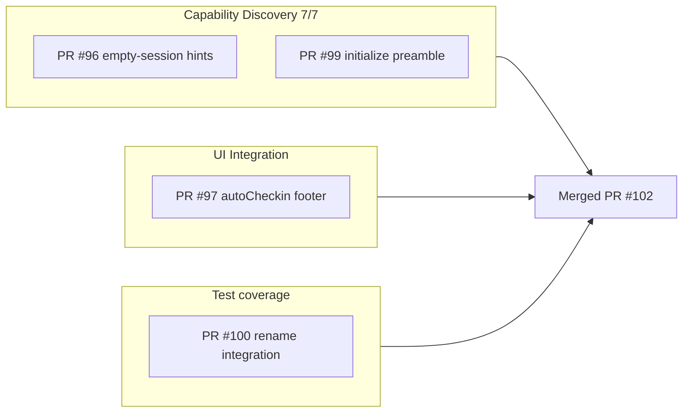

# Agent-native discovery arc

## Problem

After the PR #49 agent-native audit follow-up (~74% score), four discovery and UI-integration gaps remained: reactive empty-session responses, silent auto-checkin with no outcome feedback, no MCP `initialize` preamble, and missing Ghidra integration proof for variable rename persistence.

## Solution (PR #102, merged `d3c0c4e`)

Supersedes individual PRs #96–#101 in one squash merge to `master`.

| PR | Deliverable | Key files |
|----|-------------|-----------|
| [#96](https://github.com/bolabaden/AgentDecompile/pull/96) | `sessionEmpty`, `sessionHint`, `nextSteps` on empty discovery tools | `response_formatter.py`, `project.py` |
| [#97](https://github.com/bolabaden/AgentDecompile/pull/97) | `autoCheckin` summary on mutating tools | `program_metadata.py`, `tool_providers.py` |
| [#99](https://github.com/bolabaden/AgentDecompile/pull/99) | `InitializeResult.instructions` tiered preamble | `tool_reference.py`, `server.py`, `bridge.py` |
| [#100](https://github.com/bolabaden/AgentDecompile/pull/100) | PyGhidra integration test for rename persistence | `tests/test_variable_rename_integration.py` |
| [#102](https://github.com/bolabaden/AgentDecompile/pull/102) | **Stack merge** — all below | `master` @ `d3c0c4e` |

## Agent connect workflow (post-merge)

1. **Initialize** — read `instructions` for tier routing (PR #99)
2. **Capabilities** — `resources/read` → `agentdecompile://capabilities`
3. **Session probe** — `list-project-files` / `get-current-program`; follow bootstrap `nextSteps` when `sessionEmpty` (PR #96)
4. **Mutate + persist** — read `autoCheckin` footer when env enabled (PR #97)

## Prevention

- Discovery improvements should cover both **connect-time** (initialize) and **first-tool-call** (empty session) surfaces
- Silent middleware must surface outcomes on the parent response (auto-checkin pattern)
- Close residual tracker entries when optional integration tests land

## Related

- Audit: [2026-05-24-agent-native-audit.md](../../audits/2026-05-24-agent-native-audit.md)
- [empty-session-bootstrap-hints.md](empty-session-bootstrap-hints.md) (PR #96 branch)
- [mcp-initialize-instructions-preamble.md](mcp-initialize-instructions-preamble.md) (PR #99 branch)
- [auto-checkin-response-footer.md](auto-checkin-response-footer.md) (PR #97 branch)
- [variable-rename-integration-test.md](variable-rename-integration-test.md) (PR #100 branch)
