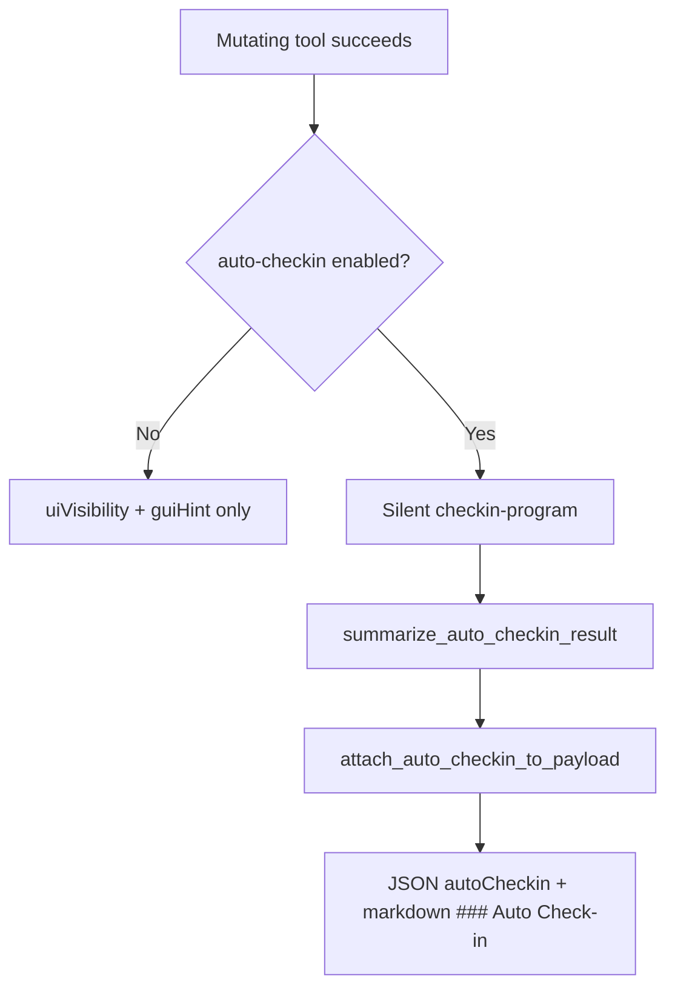

# Auto-checkin response footer

## Problem

When `AGENTDECOMPILE_AUTO_CHECKIN=1`, the server runs `checkin-program` silently after mutating tools. Agents received `uiVisibility.autoCheckinEnabled` and a `guiHint` pre-declaring the mode, but not whether persistence succeeded or which programs failed.

## Solution (PR #97)

| Field | Purpose |
|-------|---------|
| `autoCheckin.performed` | True when silent check-in ran |
| `autoCheckin.success` | Aggregate outcome (parent mutation still succeeds) |
| `autoCheckin.succeededCount` / `failedCount` | Per-program tallies |
| `autoCheckin.hint` | One-line human summary appended to `guiHint` |
| `autoCheckin.results` | Compact per-program entries (max 10) |

**Implementation:**

- `summarize_auto_checkin_result()` and `attach_auto_checkin_to_payload()` in `program_metadata.py`
- Merge in `ToolProviderManager.call_tool` after silent check-in (`tool_providers.py`)
- Markdown `### Auto Check-in` footer in `response_formatter.py`

**Tests:** `tests/test_auto_checkin_footer.py` (5 unit tests)

## Agent workflow

1. Enable auto-checkin: `AGENTDECOMPILE_AUTO_CHECKIN=1` (or HTTP header `X-AgentDecompile-Auto-Checkin: 1`)
2. Call a mutating tool (e.g. `manage-comments` set)
3. Read `autoCheckin` in JSON or `### Auto Check-in` in markdown — verify persistence before assuming GUI sync

## Prevention

- When extending silent middleware, surface outcomes on the parent response — do not discard side-effect results
- Parent mutation success must not be downgraded when check-in fails; report via `autoCheckin.success: false`
- Reuse `payload_has_mutating_action()` scoping for UI hints and auto-checkin triggers

## Related

- Plan: [2026-05-24-lfg-auto-checkin-footer-c2bc.md](../../plans/2026-05-24-lfg-auto-checkin-footer-c2bc.md)
- Audit: [2026-05-24-agent-native-audit.md](../../audits/2026-05-24-agent-native-audit.md)
- Patterns: [agent-native-mcp-patterns.md](agent-native-mcp-patterns.md)
- PR #97: https://github.com/bolabaden/AgentDecompile/pull/97
