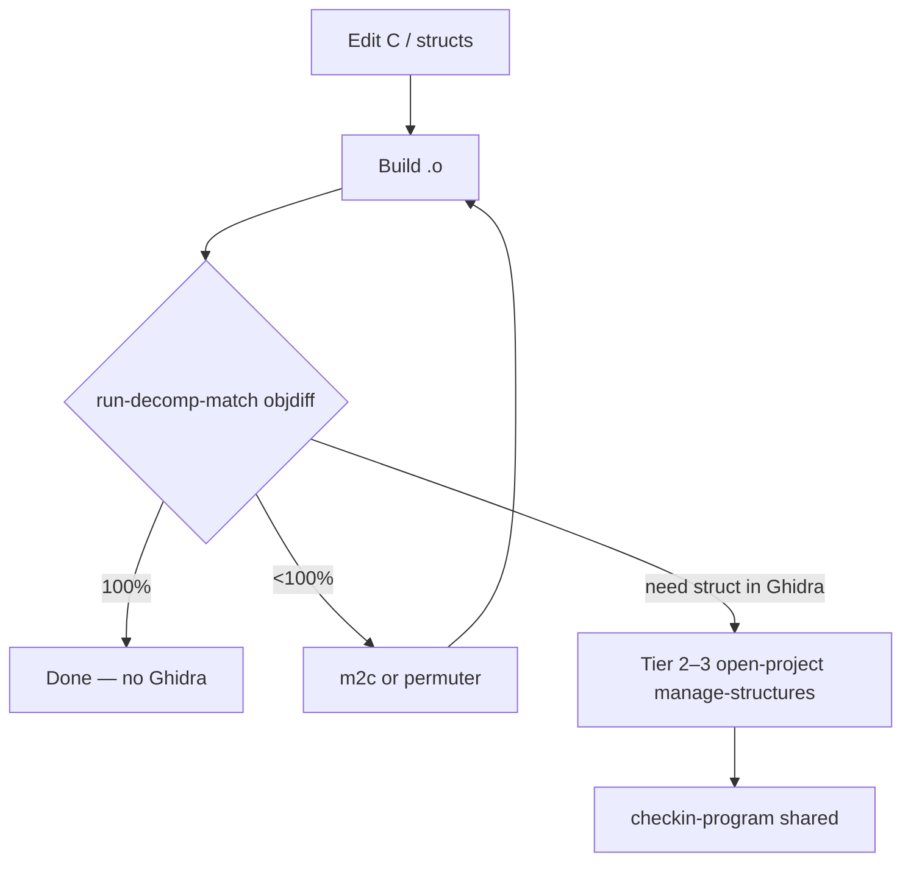

# Decomp matching toolchain

## Problem

Game decomp projects (e.g. [zeldaret/tww decompiling.md](https://github.com/zeldaret/tww/blob/main/docs/decompiling.md)) rely on **objdiff** for bytecode/object match verification, **m2c** for assembly→C (especially switches), and **decomp-permuter** for near-matches. AgentDecompile had Tier 0–1 ghidrecomp and triage tools but no MCP facade for this loop. Agents either skipped bytecode verification or paid Ghidra startup cost for work that external tools handle faster.

## Solution

**`run-decomp-match`** (Tier 1) wraps subprocess calls to m2c, objdiff-cli, and permuter when on PATH. Responses include `routing` metadata:

| Key | Meaning |
|-----|---------|
| `bytecodeMatchTool` | `objdiff` — instruction/object match % |
| `notBytecodeMatch` | `match-function` — signature/name/call-graph only |
| `sharedProjectNote` | Ghidra MCP for checkout/struct/check-in, not verify loops |

## Local vs shared Ghidra

| Scenario | Tier 1 (no JVM) | Ghidra MCP |
|----------|-----------------|------------|
| Local decomp checkout | objdiff, m2c, permuter | Optional struct export |
| Shared Ghidra Server | objdiff, m2c, permuter | **Required** for checkout, struct export, check-in |

## Agent loop (recommended)

1. `run-decomp-match` `tool=m2c` on `.s` when Ghidra/objdiff assembly is insufficient (switches).
2. Edit C; build to produce base `.o`.
3. `run-decomp-match` `tool=objdiff` `projectPath` + `unitName` — **bytecode success criterion**.
4. If close but not matching: `tool=permuter`.
5. Only when structs/context need Ghidra: `open-project` → `manage-structures` → `checkin-program` (shared).

## Implementation

- `src/agentdecompile_cli/mcp_utils/decomp_match.py`
- `src/agentdecompile_cli/mcp_server/providers/decomp_match.py`
- Tests: `tests/test_run_decomp_match.py`

## Related

- [tiered-re-analysis-knowledgebase.md](./tiered-re-analysis-knowledgebase.md)
- [TOOLS_LIST.md](../../../TOOLS_LIST.md) — `run-decomp-match`, `match-function` distinction
- Skill: `.cursor/skills/tiered-re-analysis/SKILL.md`
