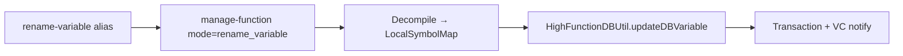

# Decompiler variable mutations

## Problem

Registry aliases (`rename-variable`, `set-local-variable-type`, `change-variable-datatypes`) and CLI `--action` values existed, but `GetFunctionToolProvider` only handled function-level modes. Agents following the TOOLS_LIST Deep Analysis loop could not persist decompiler variable names or types.

## Solution (PR #92)



| Mode | Alias tools | Key args |
|------|-------------|----------|
| `rename_variable` | `rename-variable`, `rename-variables` | `variableName`/`oldName`, `newName`, `variableMappings` |
| `set_variable_type` | `set-local-variable-type` | `variableName`, `newType`, `datatypeMappings` |
| `change_datatypes` | `change-variable-datatypes` | batch type and/or rename mappings |

**Implementation:** `src/agentdecompile_cli/mcp_server/providers/getfunction.py`

- Alias `HANDLERS` preset `mode` (same pattern as `manage-enums`)
- Decompile via `acquire_decompiler_for_program` → find `HighSymbol` by name → `HighFunctionDBUtil.updateDBVariable` inside program transaction
- Modification conflict flow when overwriting custom variable names/types
- Unit tests: `tests/test_manage_function_variables.py` (schema, aliases, mapping parser)
- Integration test: `tests/test_variable_rename_integration.py` — see [variable-rename-integration-test.md](variable-rename-integration-test.md) (PR #100)

## Agent workflow (Tier 3)

1. **READ** — `decompile-function` / `get-function` to inspect locals (`local_8`, `uVar2`, …)
2. **IMPROVE** — `rename-variable` with `camelCase` names per AGENTS.md; `set-local-variable-type` for evident types
3. **VERIFY** — Re-decompile; use `analyze-data-flow` `variable_accesses` if needed
4. **PERSIST** — `checkin-program` or enable auto-checkin

Example mappings:

```
rename-variable: variableName=local_8, newName=slotIndex
set-local-variable-type: variableName=local_10, newType=uint32_t
variableMappings: var_1:itemCount,local_8:slotIndex
```

## Prevention

- When adding registry aliases for `manage-function`, add matching `HANDLERS` alias entries that preset `mode`
- Extend `manage-function` schema `mode` enum when adding new modes
- Add unit tests for schema + alias dispatch (mirror `test_manage_enums.py`)
- Update audit/residual docs when closing agent-native CRUD gaps

## Related

- Plan: [2026-05-30-lfg-rename-variable-handlers-c2bc.md](../../plans/2026-05-30-lfg-rename-variable-handlers-c2bc.md)
- Residual: [impl-agent-native-audit-c2bc.md](../../residual-review-findings/impl-agent-native-audit-c2bc.md)
- Audit: [2026-05-24-agent-native-audit.md](../../audits/2026-05-24-agent-native-audit.md)
- PR #92: https://github.com/bolabaden/AgentDecompile/pull/92
- PR #100 (integration test): https://github.com/bolabaden/AgentDecompile/pull/100
