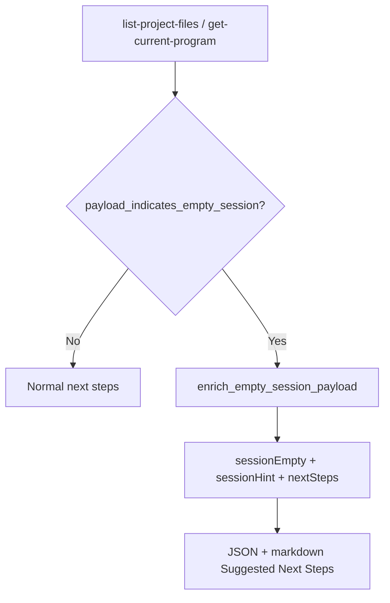

# Empty-session bootstrap hints

## Problem

On a fresh MCP session, `list-project-files` returned `count: 0` with `"No project loaded"` and `get-current-program` returned `loaded: false` without telling agents what to do next. Capability Discovery scored **Empty state** as reactive errors only (5/7).

## Solution (PR #96)

| Field | Purpose |
|-------|---------|
| `sessionEmpty` | Boolean flag for agents parsing JSON |
| `sessionHint` | One-line summary: no project/program loaded |
| `nextSteps` | Bootstrap commands: `import-binary`, `open`, `connect-shared-project`, `analyze-program` |

**Implementation:** `src/agentdecompile_cli/mcp_server/response_formatter.py`

- `payload_indicates_empty_session()` — detects no project/programs (not merely empty folder)
- `enrich_empty_session_payload()` — attaches bootstrap fields
- `_next_steps_project()` — reuses bootstrap steps for markdown `### Suggested Next Steps`

**Handlers:** `src/agentdecompile_cli/mcp_server/providers/project.py`

- `_handle_list` and `_handle_get_current_program` call enrich on empty paths

**Tests:** `tests/test_empty_session_hints.py` (7 unit tests)

## Agent workflow

1. **Probe session** — `list-project-files` or `get-current-program` on connect
2. **Read bootstrap** — when `sessionEmpty: true`, follow `nextSteps` (local `open`/`import-binary` or shared `connect-shared-project`)
3. **Analyze** — `analyze-program`, then Tier 2–3 tools

## Prevention

- When adding session-bootstrap tools, call `enrich_empty_session_payload()` on empty success paths
- Keep hint text centralized in `response_formatter.py` (JSON + markdown parity)
- Do not inject bootstrap `nextSteps` on every tool — limit to discovery endpoints

## Related

- Plan: [2026-05-24-lfg-empty-session-hints-c2bc.md](../../plans/2026-05-24-lfg-empty-session-hints-c2bc.md)
- Audit: [2026-05-24-agent-native-audit.md](../../audits/2026-05-24-agent-native-audit.md)
- Patterns: [agent-native-mcp-patterns.md](agent-native-mcp-patterns.md)
- PR #96: https://github.com/bolabaden/AgentDecompile/pull/96
