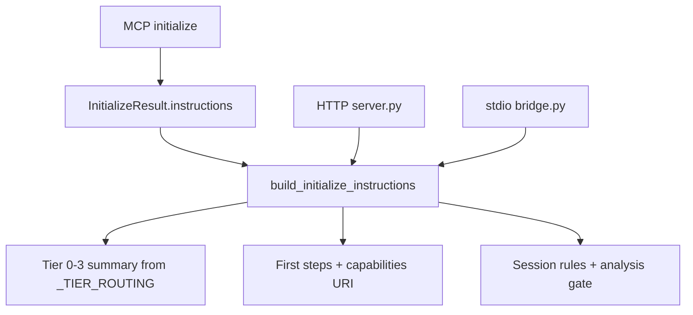

# MCP initialize instructions preamble

## Problem

MCP clients connect and call `tools/list` without tiered bootstrap guidance. The `agentdecompile://capabilities` resource (PR #64) provides machine-readable inventory, but agents had to discover it separately. Capability Discovery scored **Agent self-describes** as per-tool hints only (5/7).

## Solution (PR #99)

| Section | Content |
|---------|---------|
| Tiered bootstrap | Tier 0–3 summaries derived from `_TIER_ROUTING` |
| First steps | `run-file-triage` → `open-project` → analysis gate → Tier 2/3 |
| Discovery | `agentdecompile://capabilities`, `prompts/get`, `projectContext` |
| Session rules | `mcp-session-id`, analysis gate, conflict flow, GUI reload note |

**Implementation:**

- `build_initialize_instructions()` in `tool_reference.py` (shares tier labels with capabilities payload)
- Wired via `Server(..., instructions=...)` in `mcp_server/server.py` and `bridge.py`
- Length budget: ≤2KB UTF-8

**Tests:** `tests/test_initialize_instructions.py` (4 unit tests)

## Agent workflow

1. **On connect** — read `InitializeResult.instructions` for tier routing and first steps
2. **Deep inventory** — `resources/read` → `agentdecompile://capabilities`
3. **Session probe** — `list-project-files` or `get-current-program` (empty-session hints in PR #96 when merged)
4. **Guided workflows** — `prompts/list` + `prompts/get`

## Prevention

- Keep preamble concise — point to capabilities resource for full tool inventory
- Derive tier text from `_TIER_ROUTING` to avoid drift with capabilities payload
- Wire both HTTP and stdio/proxy `Server` constructors when adding initialize surfaces

## Related

- Plan: [2026-05-24-lfg-mcp-initialize-preamble-c2bc.md](../../plans/2026-05-24-lfg-mcp-initialize-preamble-c2bc.md)
- Capabilities resource: [capabilities-mcp-resource.md](capabilities-mcp-resource.md)
- Audit: [2026-05-24-agent-native-audit.md](../../audits/2026-05-24-agent-native-audit.md)
- PR #99: https://github.com/bolabaden/AgentDecompile/pull/99
