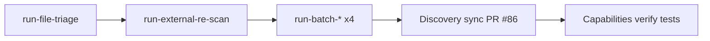

# Tier 0–1 MCP tools and discovery sync

## Problem

Tiered RE routing (PR #62) defined Tier 0–1 conceptually, but agents still lacked first-class MCP tools for cold-binary triage and batch export. After implementing six `run-*` tools (PRs #80–#85), human-facing discovery surfaces drifted (60/56 counts) and described Tier 1 as CLI-only.

## Solution arc

| Tier | MCP tools | PR |
|------|-----------|-----|
| 0 | `run-file-triage`, `run-external-re-scan` | #84, #82 |
| 0 embed | `externalScanTools` on triage | #85 |
| 1 | `run-batch-decompile`, `run-batch-export-gzf`, `run-batch-bsim-signatures`, `run-batch-sast-scan`, **`run-decomp-match`** | #80–#83, #113 |

**Discovery sync (PR #86):** Updated `.cursorrules`, `/capabilities`, `/help`, RE Planner, artifact protocol, KB, README/USAGE to **67 canonical / 63 advertised** (after `run-decomp-match`, PR #113) and document tier 0–1 `run-*` tools.

**Capabilities verification:** `tests/test_capabilities_resource.py` asserts each `run-*` appears in `agentdecompile://capabilities` with correct `analysis_tier` and dynamic summary counts.

## Agent routing (after arc)

1. Cold binary → **`run-file-triage`** (optional **`externalScanTools`**) before `open-project`.
2. Bulk offline → **`run-batch-*`** before long-lived MCP session.
3. Session bootstrap → `resources/read` **`agentdecompile://capabilities`** for tier routing + tool inventory.

## Prevention

- When adding `Tool` enum entries, update dynamic parity tests — not hardcoded counts in prose.
- Extend `test_capabilities_payload_includes_tier01_run_tools` when new tier 0–1 tools ship.
- Keep `_TIER_ROUTING` in `tool_reference.py` aligned with KB tier tables.

## Related

- KB: [tiered-re-analysis-knowledgebase.md](./tiered-re-analysis-knowledgebase.md)
- Capabilities: [capabilities-mcp-resource.md](./capabilities-mcp-resource.md)
- Skill: `.cursor/skills/tiered-re-analysis/SKILL.md`
- PR #86: https://github.com/bolabaden/AgentDecompile/pull/86
