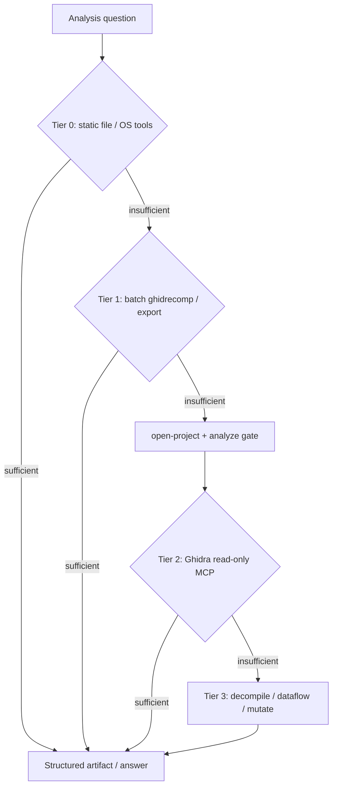

# Tiered reverse-engineering analysis — knowledge base

## Objective

Agents and skills should **not default to Ghidra** for every RE task. Use the **fastest technique that satisfies quality requirements**, then escalate to PyGhidra/Ghidra MCP only when lighter tiers cannot answer the question or when mutating the Ghidra program database is required.

This document is the institutional routing guide for AgentDecompile agents, skills, and MCP prompts.

## Core workflow (multi-agent RE)

AgentDecompile implements a **Planner → Worker → Critic → Aggregator** pipeline with **artifact-based convergence** (see `.github/agents/` and `.github/instructions/re-artifact-protocol.instructions.md`).

| Phase | Agent | Uses Ghidra? | Output |
|-------|-------|--------------|--------|
| Binary triage | RE Planner | Tier 0–2 only until scope is known | `analysis/triage.json` |
| Function analysis | RE Worker | Tier 2–3 when decompile/xrefs needed | `analysis/worker_raw/*.json` |
| Verification | RE Critic | Tier 2–3 to independently verify claims | `analysis/reviews/*.json` |
| Consensus | RE Aggregator | Tier 3 only to apply findings (confidence ≥ 0.7) | `analysis/functions/*.json` |

**Planner rule:** Run Tier 0 (and Tier 1 when batch export is cheaper) **before** `open-project` unless the binary is already in a Ghidra project or shared server session.

**Worker rule:** Prefer `get-functions` disassemble + targeted `decompile-function` over bulk `execute-script` unless no other tool covers the operation.

**Critic rule:** Re-fetch evidence with MCP tools; never trust Worker prose without binary-backed checks.

## Tool tiers

### Tier 0 — No Ghidra (prefer first)

**When:** Unknown binary, triage, keyword hunting, format identification, malware family hints, “is this worth loading?”

**Latency:** Milliseconds to low seconds. **No JVM.**

| Technique | Example commands | Answers |
|-----------|------------------|---------|
| File metadata | `file`, `stat`, `sha256sum` | Format, bitness, integrity |
| Strings | `strings -a`, `rg` on raw file | API names, URLs, error messages |
| PE/ELF headers | `readelf -a`, `objdump -x`, `llvm-objdump -h` | Sections, imports (static), entry |
| Symbol table (if present) | `nm`, `readelf -s` | Exported symbols without analysis |
| Entropy / carving | `binwalk -E`, `binwalk` signatures | Packing, embedded blobs |
| Rule matching | `yara`, `capa` (if installed) | Capability / behavior hints |
| Diff / similarity | `ssdeep`, `cmp` | Related samples |

**Escalate to Tier 1+ when:** You need recovered functions, cross-references, types, or anything that requires disassembly beyond import table stubs.

### Tier 1 — Batch / offline (Ghidra optional)

**When:** Bulk decompile export, call-graph artifacts, SAST on generated C, BSim signature generation, one-shot analysis scripts without MCP session.

**Latency:** Seconds to minutes. **May spawn Ghidra headless** but not the long-lived MCP JVM session.

| Technique | Entry point | Answers |
|-----------|-------------|---------|
| Batch decompile | `uv run agentdecompile-cli ghidrecomp decompile …` | C files for ripgrep/semgrep |
| Call graph export | ghidrecomp / `gen-callgraph` after import | Mermaid/DOT graphs |
| SAST on decomp | `ghidrecomp … --sast` (semgrep/CodeQL) | Vuln patterns in pseudocode |
| Static analysis resource | MCP `export` / import-export SARIF paths | Downstream scanners |
| Packed project snapshot | `.gzf` export | Share analyzed state |

**Escalate to Tier 2+ when:** Interactive xref/decompile loops, session-stable multi-tool agents, shared Ghidra Server checkout, or live mutations.

### Tier 2 — Ghidra MCP read-only (after open + analysis gate)

**When:** Precise xrefs, function lists, imports/exports from analyzed DB, string search in program, memory layout, search without decompilation.

**Requires:** `open-project` / `import-binary`, **`projectContext.analysisComplete === true`** (analysis gate).

| MCP tools | Prefer over |
|-----------|-------------|
| `list-functions`, `list-imports`, `list-exports`, `list-strings` | Re-importing or raw `strings` when DB is already warm |
| `search-symbols`, `search-strings`, `search-constants`, `search-everything` | Blind file grep when symbols exist |
| `get-references`, `list-cross-references`, `get-call-graph` | Manual call-graph reconstruction |
| `get-function`, `get-functions` (metadata / disassemble view) | Full decompile for size/entry only |
| `get-data`, `inspect-memory` | Hex dumps without context |
| `checkout-status`, `list-project-files` | N/A (session/project) |

**Escalate to Tier 3 when:** Pseudocode semantics, data-flow, vtables, type recovery, renaming, comments, structures, cross-binary `match-function` propagation.

### Tier 3 — Ghidra deep / mutating (use when necessary)

**When:** Decompilation quality matters, type/symbol mutations, structure recovery, data-flow, applying consensus back to the program DB.

| MCP tools | Notes |
|-----------|-------|
| `decompile-function`, `get-functions` (decompile view) | Compare with disassembly; flag decompiler artifacts |
| `analyze-data-flow`, `analyze-vtables` | Expensive; scope to one function |
| `manage-function`, `rename-function`, `set-function-prototype` | Apply Aggregator outputs |
| `manage-structures`, `manage-enums`, `apply-data-type` | Data Architect phase |
| `manage-comments`, `manage-bookmarks`, `manage-function-tags` | Librarian / documentation |
| `match-function` | Cross-binary; signature + call-graph heuristic |
| `execute-script` | **Last resort** when no advertised tool covers the operation |

**Mutations:** Expect `uiVisibility` / `guiHint`; use `checkin-program` or `AGENTDECOMPILE_AUTO_CHECKIN=1`. Respect modification-conflict two-step flow (`conflictId` → `resolve-modification-conflict`).

## Decision matrix (quick reference)

| Question | Start tier | Ghidra tool (if needed) |
|----------|------------|-------------------------|
| What file type / bitness? | 0 | — |
| Any obvious strings/APIs? | 0 | — |
| Where is `main` / entry? | 0 → 2 | `list-exports`, `list-functions` |
| Who calls function X? | 2 | `get-references`, `get-call-graph` |
| What does function X do? | 2 → 3 | `decompile-function` + disassemble compare |
| Recover struct at address? | 3 | `manage-structures`, `apply-data-type` |
| Same function in binary B? | 3 | `match-function` |
| Bulk rename 500 functions | 1 → 3 | Batch plan in Aggregator; apply via Tier 3 |
| Prove shared-server checkout | 2 | `checkout-status`, `checkin-program` |

## MCP prompt routing (nine workflows)

Map prompts to tiers (see `prompt_providers.py`):

| Prompt | Primary tiers | Ghidra-heavy steps |
|--------|---------------|-------------------|
| `re-scout-broad-sweep` | 0 → 2 | xrefs, namespaces |
| `re-bottom-up-analyst` | 2 → 3 | decompile chains from I/O imports |
| `re-top-down-analyst` | 2 → 3 | entry-point decompile |
| `re-diver-deep-dive` | 3 | full decompile batches |
| `re-data-architect` | 3 | types, structs, prototypes |
| `re-exhaustive-librarian` | 2 → 3 | annotate DB |
| `re-bridge-builder` | 2 → 3 | `match-function` |
| `re-convergence-orchestrator` | 2–3 | multi-pass compare |
| `re-iterative-verifier` | 2–3 | re-verify claims |

Run **Scout (Tier 0–2)** before **Diver (Tier 3)** on cold binaries.

## Performance and quality rules

1. **Cold binary:** Tier 0 triage → decide if `open-project` is worth JVM cost (~3s+ init).
2. **Warm session:** Skip Tier 0 for questions already in the Ghidra DB; use Tier 2 list/search tools.
3. **Analysis gate:** Never call Tier 2–3 program-scoped tools until `projectContext.analysisComplete` is true (or gate returns ready).
4. **Pagination:** Use `limit`/`offset` on `list-functions`, `list-strings` — avoid dumping entire programs in one call.
5. **Redundant Ghidra polls:** Session flag fast-paths exist when analysis is already complete (`program_analysis.py`).
6. **Parallelism:** Independent Tier 0/1 tasks can run in parallel; Tier 3 mutations on the same program should stay serialized per session.
7. **Evidence:** Workers must cite Tier 0 outputs (file hashes, string addresses) and Tier 2–3 tool results in artifacts — not LLM memory.

## Anti-patterns

| Anti-pattern | Fix |
|--------------|-----|
| `open-project` before reading strings/headers | Run Tier 0 triage first |
| `decompile-function` on every function for triage | Use `list-functions` + `list-strings` |
| `execute-script` for listing imports | Use `list-imports` |
| `search-everything` with empty query | Provide `query` or use scoped list tools |
| Mutating without Critic review | Run RE Critic on high-priority functions |
| Ignoring analysis gate timeouts | Fix with `analyze-program` or increase `timeout` |

## Registry metadata (`analysis_tier`)

Every canonical MCP tool exposes **`analysis_tier`** via `get_tool_metadata()` and the OpenAPI/tool-reference payload (`server.py`):

| Value | Meaning |
|-------|---------|
| **2** | Ghidra MCP read-only / session bootstrap (prefer before decompile) |
| **3** | Deep analysis, workflow bundles, or mutating tools |

Tier 0–1 remain shell/`ghidrecomp` paths documented above; they are not MCP tools.

Implementation: `_TIER3_GHIDRA_TOOLS` and `get_tool_analysis_tier()` in `registry.py`; tests in `tests/test_tool_analysis_tier.py`.

## Future extensions

Track in plans; prefer Tier 0 wrappers before new Ghidra providers:

- MCP or CLI wrappers for `capa`, `yara`, `binwalk` with unified JSON schema
- ~~`agentdecompile://capabilities` resource listing tier per tool~~ — **Done** (`CapabilitiesResource`, `agentdecompile://capabilities`)
- Tier 1 MCP facade over `ghidrecomp` subcommands for agents without shell
- ~~Optional runtime filter on `tools/list` by max tier~~ — **Done** (`AGENTDECOMPILE_MAX_ANALYSIS_TIER`, `X-AgentDecompile-Max-Analysis-Tier`, `get_advertised_tools_for_list()`)

## Related docs

- [RE artifact protocol](../../../.github/instructions/re-artifact-protocol.instructions.md)
- [Program analysis coordinator](./program-analysis-coordinator.md)
- [Agent-native MCP patterns](./agent-native-mcp-patterns.md)
- [Agent-native audit](../../audits/2026-05-24-agent-native-audit.md)
- Skill: [.cursor/skills/tiered-re-analysis/SKILL.md](../../../.cursor/skills/tiered-re-analysis/SKILL.md)

## Note on source article

The user-requested external article URL was not attached in the originating session. This knowledge base synthesizes AgentDecompile’s in-repo multi-agent RE architecture, Kong/FORGE-style phased pipelines, and agent-native primitive-tier guidance. If you have a specific article URL, add it to `sources` in frontmatter and extend the tier tables with any unique steps from that publication.
