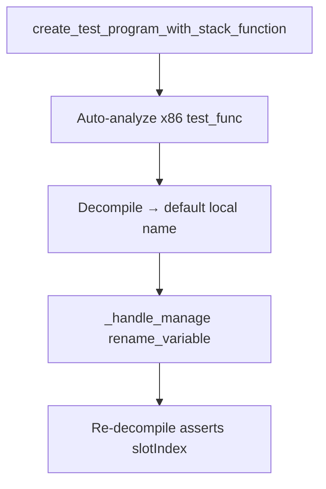

# Variable rename integration test

## Problem

`manage-function` `rename_variable` shipped in PR #92 with unit tests for schema, aliases, and mocked handlers. The agent-native residual tracker listed an optional integration test to prove decompiler variable renames persist through `HighFunctionDBUtil.updateDBVariable` and appear in re-decompiled C.

## Solution (PR #100)

| Piece | Purpose |
|-------|---------|
| `ghidra_install_available()` | Skip when `GHIDRA_INSTALL_DIR` missing or invalid |
| `create_test_program_with_stack_function()` | Assemble stack-frame function with `local_4`-style locals |
| `test_rename_variable_persists_in_decompiled_output` | Provider-level integration via `GetFunctionToolProvider` |

**Files:**

- `tests/helpers.py` — `ghidra_install_available()`, `create_test_program_with_stack_function()`
- `tests/test_variable_rename_integration.py` — 1 unit skip-guard test + 1 integration test

## Test pattern

1. **Guard** — `@pytest.mark.integration` + `skipif(not ghidra_install_available())`
2. **Fixture** — module-scoped `stack_function_program` with dispose in teardown
3. **Arrange** — decompile to find first default local (`local_*`, `uVar*`, etc.)
4. **Act** — `_handle_manage` with `mode=rename_variable`, `newName=slotIndex`
5. **Assert** — JSON success + re-decompiled C contains `slotIndex`, not original name

## Agent / CI workflow

- **CI without Ghidra:** integration test skips; unit guard test passes
- **Local / LFG with Ghidra:** `uv run pytest tests/test_variable_rename_integration.py -m integration -v --timeout=180`
- **When adding similar tests:** reuse `create_test_program_with_stack_function()` or mirror `create_test_program()` assembler pattern

## Prevention

- Unit tests prove dispatch/schema; integration tests prove Ghidra DB persistence for decompiler mutations
- Always skip gracefully when `GHIDRA_INSTALL_DIR` unavailable (cloud agents, minimal CI)
- Close residual tracker entries when integration coverage lands

## Related

- Handlers: [decompiler-variable-mutations.md](decompiler-variable-mutations.md)
- Plan: [2026-05-24-lfg-variable-rename-integration-c2bc.md](../../plans/2026-05-24-lfg-variable-rename-integration-c2bc.md)
- Residual: [impl-agent-native-audit-c2bc.md](../../residual-review-findings/impl-agent-native-audit-c2bc.md)
- PR #100: https://github.com/bolabaden/AgentDecompile/pull/100
