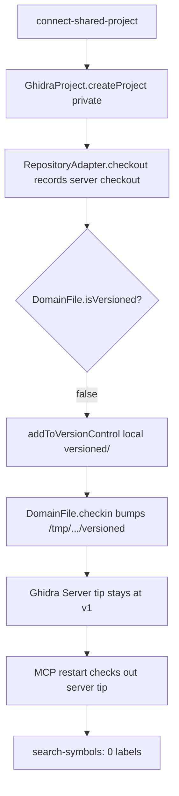
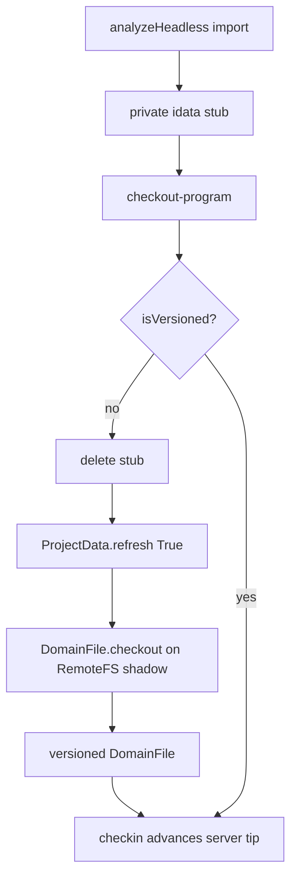

# Shared checkin must push to Ghidra Server (not local VC mirror)

## Symptom

LFG step 5 (`05_assert_shared_after_mcp`): after three shared label+checkin cycles and an MCP restart, `search-symbols` for `sh_<RunId>_` returns **0 results**. Same-session `02d` search found L1–L3.

## Root cause

Evidence from `linuxsmoke145337`:

| Location | History |
|----------|---------|
| `/tmp/agentdecompile_shared/agentrepo_*/shared.rep/versioned/` | v1–v4 with `sh_*_ck_*` comments + labels in `.gbf` |
| `.lfg_run/.../ghidra_server_repositories/agentrepo/` | **only v1** |

`GhidraProject.createProject` always builds a **non-shared** project (repository ctor arg is ignored). Without `ProjectData.convertProjectToShared`, checkin only versions the local mirror.

Secondary: LocalTrack restored parent `AGENT_DECOMPILE_GHIDRA_SERVER_*` immediately after MCP spawn, so CLI tool-seq re-injected shared headers into the “local” track.

## Fix

1. After binding the shared checkout project, call `convertProjectToShared(repository_adapter)`.
2. Refuse `addToVersionControl` in shared-server sessions (would recreate local-only VC).
3. After shared checkin, fail if the Ghidra Server tip did not advance.
4. Keep LocalTrack driver env stripped for the whole LocalTrack MCP lifetime.
5. **Follow-up (2026-07-18):** After (1)+(2), analyzeHeadless import still leaves a **private `idata` stub** that hides the RemoteFileSystem item. Checkout reported success with `is_checked_out: false` and checkin failed ("not version-controlled"). Promote by deleting the private stub, `RepositoryAdapter.checkout`, then `DomainFile.checkout` on the shadow; fail checkout if the DomainFile remains unversioned.
6. **Ghidra API requirement:** `convertProjectToShared` must be followed by **close + reopen** of the `GhidraProject`. Without reopen, `project.prp` shows SERVER/REPOSITORY but live ProjectData never mounts RemoteFileSystem — deleting the private stub leaves `getFile` empty and checkout cannot bind.
7. **Follow-up (2026-07-18, step5reopen033102):** After stub delete, call **`ProjectData.refresh(True)`** before `getFile` / `DomainFile.checkout`. `RepositoryAdapter.checkout` alone only records a server grant (`checkout.dat`); it does not bind a versioned `DomainFile` (`isVersioned` stayed false while the server logged checkout granted).

## Verification

- Unit: `tests/test_shared_checkin_local_vc_guard.py` (includes refresh-after-stub-delete)
- Smoke: Linux LFG through step 5; server `history.dat` must show versions > 1 after label checkins
- Checkout response must include `is_versioned: true` / `is_checked_out: true` for shared exclusive checkout
- MCP log should contain `reopened project after convertProjectToShared`
- After promote, prefer `Promoted shared DomainFile ... after refresh` over adapter-only checkout grants
